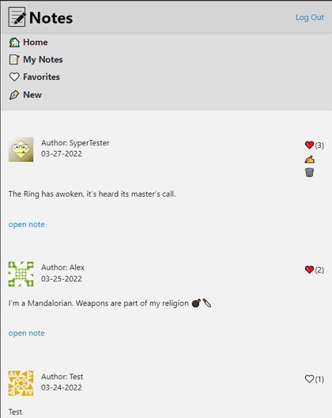

# Notes app

This repository contains front-end code of [Notes application](https://my-simple-note.netlify.app/)

## Related Repositories

Heroku is used for deploying API

Netlify is used for deploying front-end

Database is MongoDB

